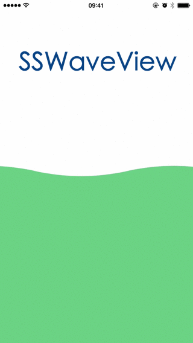

# SSWaveView
`SSwaveView` can simulate water wave.

# Language
* [English](README.md)
* [中文](doc/README_zh.md)


========================
[](http://cocoadocs.org/docsets/SSWaveView)
[](http://cocoadocs.org/docsets/SSWaveView)
[](http://opensource.org/licenses/MIT)

## Quick start

`SSWaveView` is available on [CocoaPods](http://cocoapods.org). Add the following to your `Podfile`:
```ruby
pod 'SSWaveView'
```

# Snapshot



## Document
[http://cocoadocs.org/docsets/SSWaveView/](http://cocoadocs.org/docsets/SSWaveView/)
